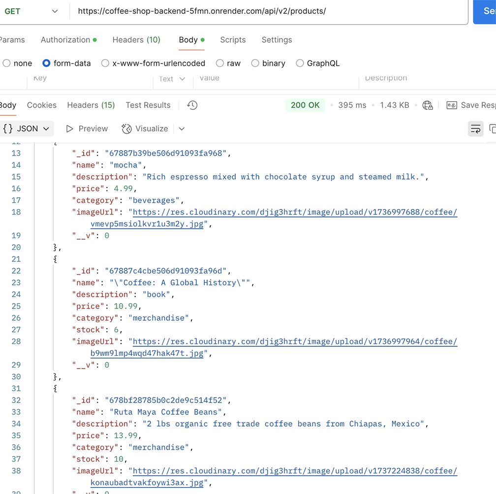
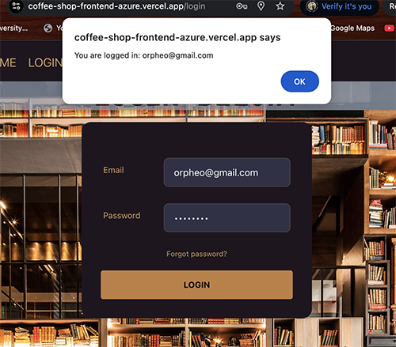

## Guide: Coffee Shop Frontend & Backend Capstone Project

Live link that displays steps initialized and completed:
- [x] https://coffee-shop-frontend-azure.vercel.app 
- [x] https://coffee-shop-frontend-azure.vercel.app/sign-up 
- [x] https://coffee-shop-frontend-azure.vercel.app/login
- [x] https://coffee-shop-frontend-azure.vercel.app/products 
- [x] https://coffee-shop-frontend-azure.vercel.app/cart 
- [x] https://coffee-shop-frontend-azure.vercel.app/checkout

## Splash Page: COFFEE, TEA, & READ!

 <br /><br />

## Objective:  

The Coffee Shop Backend and Frontend is a Node.js-based Express application that serves as an e-commerce coffee shop. It provides APIs for managing products with full CRUD (Create, Read, Update, Delete) functionality. The backend uses MongoDB with Mongoose for database operations, allowing efficient storage and retrieval of product data.

## Key Tools & Technologies
- Frontend: Next.js, DaisyUI, Tailwind CSS, Storybook, Iconify, React Hooks (useState, useQuery)
- Backend: Node.js, API v1 (non-auth) and API v2 (auth)
- Database: (Database type to be decided: e.g., Vercel, MongoDB, Postman, PostgreSQL)
- Version Control: Git/GitHub

## Components
- [x] Button
- [x] Cart Icon
- [x] Cart Summary
- [x] Checkout Form
- [x] Footer
- [x] Header
- [x] Login Form
- [x] Navbar
- [x] Product Card
- [x] Signup Form
- [x] Test Button


## Features
- [x] **Tailwind CSS with DaisyUI Theme integration.**
- [x] **Test Custom CSS**
- [x] **Storybook for component development.**
- [x] **Create Skeleton for All Components**
- [x] **Create Stub Functions for all Components**
- [x] **Implement Product List Page Functionality**
- [x] **Verify in Storybook**
- [x] **Implement Shopping Cart Page Functionality**
- [x] **Implement Login and Register Pages**
- [x] **CRUD Operations: Implemented APIs for managing products, including creating, reading,** 
- [x] **Updating, and deleting.JWT User Authentication & Protected Routes**


### **Splash Home Page. Break Splash Page Into Components**
In `index.jsx`, build a splash page that includes the following:
- [x] - **Header**
- [x] - **Hero Image with Call-to-Action (CTA) Button**
- [x] - **Brief Description**
- [x] - **Footer**
- [x] - Split the page into components, such as `Header`, `Footer`, `HeroSection`, and `Button`.
- [x] - Verify each component works in Storybook.
- [x] - Create a new story for each new component.


## Deploy on Vercel

 <br /><br />

## Step 0: **Setup Storybook**

a. **Install Storybook**:

   ```bash
   npx storybook@latest init
   ```

b. **Run Storybook**:

Storybook may will already be running after the installation. If not, you can start it with:

   ```bash
   npm run storybook
   ```

- [x] - Verify Storybook runs at [http://localhost:6006](http://localhost:6006).
- [x] - Verify all components render correctly in Storybook.
- [x] - Add one screenshot of the Storybook interface to your README.md

 <br /><br />

## Step 1: **Setup .env File and Connect to Backend**

1. **Create `.env.local` File**:

   ```plaintext
   NEXT_PUBLIC_API_BASE_URL=http://localhost:3000
   NEXT_PUBLIC_API_BASE_URL_PROD=https://api.onrender.com
   ```

2. **Connect to POSTMAN Backend**:
   - POST Products on Postman Backend URL 

    <br /><br />

   - GET All Products

    <br /><br />

3. **Test Backend Connection**:
   - Verify the console logs the response from the backend.

---

## **Step 2: Create Stub Functions**

### **Instructions**:
1. **Stub Functions**: Create empty functions in the respective Page components. For now, these will log messages to the console or display alerts.
2. **Placement**:
   - Add the functions inside the **Page function** of each page.
   - Some will be triggered on page load using `useEffect`.
   - Others will be triggered by button clicks.
3. **Prop Drilling**: Pass functions as props to child components where needed.

### **List of Stub Functions and Locations**:
| **Page/Component**             | **Functions to Add**                          |
|---------------------------------|-----------------------------------------------|
| **Header Component**            | `goToLogin`, `goToSignup`                     |
| **Register Page** (`signup.jsx`) | `registerUser(user)`                          |
| **Login Page** (`login.jsx`)    | `signInUser(username, password)`              |
| **Product List Page**           | `loadProducts()`, `filterProducts(category, start, limit)`, `viewProduct(product)` |
| **Product Display Page**        | `fetchProduct(id)`, `addToCart(product)`      |
| **Cart Page**                   | `loadCart()`, `addToCart(product)`, `removeFromCart(product)`, `saveCartToLocalStorage(cart)` |
| **Utility Functions** (`util/index.js`) | `loadProductsFromLocalStorage`, `loadCartFromLocalStorage`, `saveCartToLocalStorage`, `saveProductsToLocalStorage`, `saveUserToLocalStorage`, `loginUserToLocalStorage` |

### **Example**:
```javascript
// src/pages/cart.jsx
import { useEffect, useState } from 'react';

import ProductCard from '@/components/ProductCard';

// Stub data for Cart Page
import data from '@/mocks/cart.json';

export default function CartPage() {
  const [cart, setCart] = useState([]);

// Stub functions for Cart Page
  const loadCart = () => console.log("Cart loaded");
  const addToCart = (product) => console.log(`Added ${product.name} to cart`);
  const removeFromCart = (product) => console.log(`Removed ${product.name} from cart`);
  const saveCartToLocalStorage = (cart) => console.log("Cart saved to localStorage");

  // use useEffect to put initialization code.
  useEffect(() => {
    loadCart();
    setCart([...data]);
  }, []);

  const handleClick = (product) => {
    addToCart(product);
  };

  // Note how we pass the handleClick function to the ProductCard component.
  // This will passed again to the button in the ProductCard component.
  // Passing a prop multiple times is called prop drilling.
  return (<div>
  <h1>Shopping Cart: {cart.length} items in cart</h1>
  {cart.map((product) => (
    <ProductCard 
      key={product.id}
      product={product}
      handleClick={() => handleClick(product)} 
    />
  ))}

  </div>);
}
```


  
## **Step 3: Implement Product List Page Functionality**
- [x] - Products fetched via Backend URL, implementing Product Card Component w product data and Add to Cart Button which redirects to the cart.js

 <br /><br />

### **Instructions**:
1. Replace stub functions with real functionality to:
   - Load and filter products.
   - Pass `viewProduct` to the button in `ProductCard` using **prop drilling**.
2. Use mock data to populate the product list.
   - check the Appendix at the end of this document for examples of mock data and utility functions.

Observe how the `viewProduct` function is passed down to the `ProductCard` component and then to the `Button` component. This is an example of **prop drilling**. You will often use this technique to pass functions down to child components. It can be tedious, but it's a common pattern in React.

Example of `viewProduct` function:
```javascript
// in src/pages/products/index.jsx
const viewProduct = (product) => {
  router.push(`/products/${product}`);
};
...
<ProductCard product={product} handleClick={() => viewProduct(product)} />
...
```

```javascript
// in src/components/ProductCard.jsx
<Button handleClick={() => handleClick(product)}>View Product</button>
```

```javascript
// in src/components/Button.jsx
export default function Button({ handleClick, label }) {
  return <button onClick={handleClick}>{label}</button>;
}
```
---

## **Step 4: Implement Product Display Page Functionality Instructions**:

1. Use `fetchProduct` to load product data via .env.local to BACKEND https://coffee-shop-backend-5fmn.onrender.com/api/v1/products/ .

2. Pass `addToCart` into the button in the `ProductCard` component using **prop drilling**.

---

## **Step 5: Implement Shopping Cart Page Functionality**:

1. Replace the stub functions for `loadCart`, `addToCart`, `removeFromCart`, and `saveCartToLocalStorage` with real functionality.

- **Key Deliverables:**
- [x] - Interactive shopping cart with add/remove item functionality.
- [x] - Fully integrated shopping cart experience.

- [x] - Stretch Goal: Empty Cart Animated Icon that redirects to Products.js Page if cart is empty

 <br /><br />

- [x] - Shopping cart saved to Local Storage, redirects to CheckOut.js

 <br /><br />
---

## **Step 5: Implement Checkout Page Functionality**

- [x] - Checkout Cart Summary and Checkout Form
- [x] - Implement a controlled form for checkout details

 <br /><br />

### **Add functionality to collect checkout information and save it to localStorage.**:

 <br /><br />

## Implement a function to save the cart order details to localStorage.

- [x] - After the form is submitted you can save the order details to localStorage. You can use the `saveCartToLocalStorage` function as a reference.

### **Shared Functions**:
1. `loadProductsFromLocalStorage()`: Returns products.
2. `loadCartFromLocalStorage()`: Returns the cart.
3. `saveCartToLocalStorage(cart)`: Saves cart to localStorage.
4. `saveProductsToLocalStorage(products)`: Saves products to localStorage.
5. `saveUserToLocalStorage(user)`: Saves user to localStorage.
6. `loginUserToLocalStorage(user)`: Saves logged-in user to localStorage.

---

## **Step 6: Implement Login and Register Pages**

### **Instructions**:
- [x] - Replace the stub functions in `registerUser` and `signInUser` with functionality to save user data to localStorage.

- [x] - Implement controlled forms for the login and register pages. Then save the data to localStorage using the utility functions.

 <br /><br />


---
## **Utility Functions in `/src/util/index.js`**


---

### **Key Tools & Technologies**
- **Frontend:** Next.js, DaisyUI, Storybook, React Hooks (useState, useQuery)
- **Backend:** Node.js, API v1 (non-auth) and API v2 (auth)
- **Database:** (Database type to be decided: e.g., MongoDB, PostgreSQL)
- **Version Control:** Git/GitHub

---

### **Expected Outcome**
By the end of Day 5, the project will be a fully functional e-commerce application with:
- Modular and reusable components.
- Secure and efficient API endpoints.
- A user-friendly shopping cart.
- A robust authentication system.


# Day 3 **5. Product Page => https://coffee-shop-frontend-azure.vercel.app/products**

### **Step 1**: Layout
- In `src/pages/products/[id].jsx`, create a layout for a single product page.
- Include a header and footer.
- import the data from the mock products file at `src/mocks/products.json`.
- Create a product card displaying:
  - Product image
  - Name
  - Description
  - Price
  - Add to Cart Button


### **Step 2**: Break Into a `ProductCard` Component
- Create or update your `ProductCard` component.
- Pass the product data as a prop to the `ProductCard` component.
- Use **PropTypes** to validate the product as an object.


### **Step 3**: Verify in Storybook
- Verify your story for `ProductCard` with mock product data.

### **Step 4**: Update Product Page to include an event handler

**Your challenge** is to create a function in `src/pages/products/[id].jsx` that will fire when the button is clicked. You can use `console.log` or `alert` to verify that the function is working.

Look at the previous examples for how to pass a function to a component.

---

## **6. Products Page**

The products page will display a list of products. You will use the `ProductCard` component to display each product. You will get the data from the mock products file and pass the data to the `ProductCard` components.

- in `src/pages/products/index.jsx`, create a layout for the products page.
- Use the `ProductCard` component to display a list of products.
- Create mock data for products and iterate over them using `.map()`.
- See [Rendering Lists](https://react.dev/learn/describing-the-ui#rendering-lists) in the React documentation for more information.


export default function ProductsPage() {
  const productsJSX = products.map((product) => {
    // Use key prop every time you use map.
    // This is a unique identifier for each product.
    // React is not smart enough to keep track of the order of items in a list.
    // so we need to give it help by providing a unique key prop.
    return (<ProductCard key={product._id} product={product} />)
  });
  return (
    <div className="products-grid">
      {productsJSX}
    </div>
  );
}
```

# Day 2 Guide: Coffee Shop Frontend => https://coffee-shop-frontend-azure.vercel.app

## Objective:  

Continue building the project you started in Day 1. Today, you will create pages for the Coffee Shop frontend, then break them into reusable components while the layout and structure are fresh in your mind. Utilize Storybook to verify components, and enhance the design for consistency across the application.

Note: If you are unable to complete the full assignment, focus on the login pages and the product pages. If you can't get to the cart, you can still make a decent project. Then, you can fill in the other pages later if you have time, or leave them as a stretch goal. However, some of the pages in the Cart functionality are repetitive, so you may be able to reuse components from the product page for the cart page.

---


## **1. Create Basic Pages**
Set up the following blank pages in the `pages` directory. These pages will serve as the foundation of your application:

### **Required Pages**:
- `index.jsx`
- `products/index.jsx`
- `products/[id].jsx`
- `cart.jsx`
- `checkout.jsx`
- `signup.jsx`
- `signin.jsx`


---


### **Step 3**: Example: Update the Button to handle click events

- in `src/components/Button.jsx`:
  ```jsx
  export default function Button({ label, handleClick }) {
    return (
      <button onClick={handleClick} className="btn btn-primary">
        {label}
      </button>
    );
  }
  ```
- in `index.jsx`:
  ```jsx
  import Button from '../components/Button';
  import { useRouter } from 'next/router';
  ...
  export default function Home() {
    const router = useRouter();
    function handleCtaClick() {
      console.log('CTA button clicked!');
      router.push('/signup');
    }
    return (
      <div>
      ...
        <Button label="Sign Up Now" handleClick={handleCtaClick} />
      ...
      </div>
    );
  }
  ```
  This will allow the button to navigate to the signup page when clicked, but also keep the Button component flexible for other uses.

---

## **3. Signup Page**

Follow a similar process to the Splash page for the signup page and the rest of the pages. The goal is to build out your design, then break it into components. This will help you keep things organized. Focus on visual design and components. You will add functionality, like button clicks, later.

### **Step 1**: Layout
- Include the header and footer components from the splash page.
- Add a form with the following fields:
  - Name
  - Email
  - Password
  - Submit Button

### **Step 2**: Break the Form Into a Component
- Create a `SignupForm` component and use the following prop:
  - **`buttonLabel`**: A string that determines the button's text.
- Use **PropTypes** to validate `buttonLabel` as a string.

Example (Note 1: insert your own JSX and design choices into this component.) (Note 2: Don't forget to include PropTypes so you can validate the prop types in storybook.):
```jsx
import PropTypes from 'prop-types';
import Button from '@/components/Button';

export default function SignupForm({ buttonLabel }) {
  return (
    <form className="form">
      <input type="text" placeholder="Name" />
      <input type="email" placeholder="Email" />
      <input type="password" placeholder="Password" />
      <Button label="Sign Up" handleClick={()=>{console.log("clicked sign up")}}/>
    </form>
  );
}

SignupForm.propTypes = {
  buttonLabel: PropTypes.string.isRequired,
};
```

### **Step 3**: Verify in Storybook
- Verify your story for `SignupForm` with a mock button label.

git commit with a message like "Add SignupForm component."

---

# Day One Setup for Coffee Shop Frontend

## Objective

Set up a solid foundation for the project by creating a Next.js app, integrating Storybook for component development, and building stubs for your components. Follow an incremental approach to ensure all components work as expected before moving forward.

---

## **1. Setup Next.js and Repository**

1. **Create a New Next.js App**:

   ```bash
   npx create-next-app@latest coffee-shop-frontend
   cd coffee-shop-frontend
   ```

   - During setup, select **Use Tailwind CSS** and **Use Pages Router** options.

2. **Initialize a Git Repository**:


3. **Test Application**:


   npm run dev
   ```
   Verify the app runs at [http://localhost:3000](http://localhost:3000).

4. **Update your README.md file.**

- delete the default content.
- add an outline of what you plan to do or the template provided in the assignment.
- commit your changes.

# Coffee Shop Frontend

This is a project to build a frontend for a coffee shop. The project will include a variety of components and features to create a user-friendly experience for customers.

## Technologies

- React
- Next.js
- Tailwind CSS
- Storybook
- DaisyUI
- Vercel

## Setup
If you would like to try this project out or contribute, follow these steps:

1. Clone the repository.
2. Run `npm install` to install dependencies.
3. Start the app with `npm run dev`.
4. Open Storybook with `npm run storybook`.

## Contributing
If you would like to contribute to this project, please follow these steps:

1. Fork the repository.
2. Create a new branch for your feature.
3. Make your changes.
4. Test your changes.
5. Push your changes to your fork.
6. Create a pull request.


## Attribution

Give credit to any resources or inspiration you used in this project.

- [Tailwind CSS](https://tailwindcss.com/)
- [DaisyUI](https://daisyui.com/)
- [Storybook](https://storybook.js.org/)


5. Update index.js file.

- delete the default content.
- add a simple heading to test the app.

```jsx
export default function Home() {
  return <h1>Coffee Shop Frontend Splash Page</h1>;
}
```

- [x] - 6. Deploy to Vercel.

It's a good idea to deploy your app to Vercel right away to ensure it works as expected in a production environment.

- Push your code to GitHub.
- Create a new project on Vercel.
- Import your project from GitHub.
- Deploy your project.
- Note: you may want to have a special branch for deployment, such as `main` or `production`.
- Note: Although you have no Environment Variables yet, remember to update your Environment Variables in Vercel to match your `.env.local` file as you add them.
- Check your deployed app to ensure it works as expected after each commit to see if you can catch any bugs as they are made.
---


2. **Add Skeleton Code and Stories**:
   - Do not complete the components yet; add a simple "Hello World" message to each component. You will have the opportunity to add more functionality later.
   - Example for `Navbar`:

     ```javascript
     // components/Navbar.js
     import PropTypes from 'prop-types';
     export default function Navbar({title}) {
       return <div className="navbar">Navbar Component {title}</div>;
     }
     Navbar.propTypes = {
       // Add prop-types here
        title: PropTypes.string.isRequired,
     };
     ```

   - Make use of snippets or copy and paste boilerplate code to speed up the process.
   - Test the components in Storybook to ensure they render correctly.
   - Click the + sign in the Storybook interface to add a new story.
   - Don't forget to click update story in storybook to save the changes, if you update controls (props).
   - Commit often to track your progress.

3. **Test Each Component in Storybook**:
- [x] - Verify all components render correctly in Storybook.
- [x] - Add one screenshot of the Storybook interface to your README.md. 


